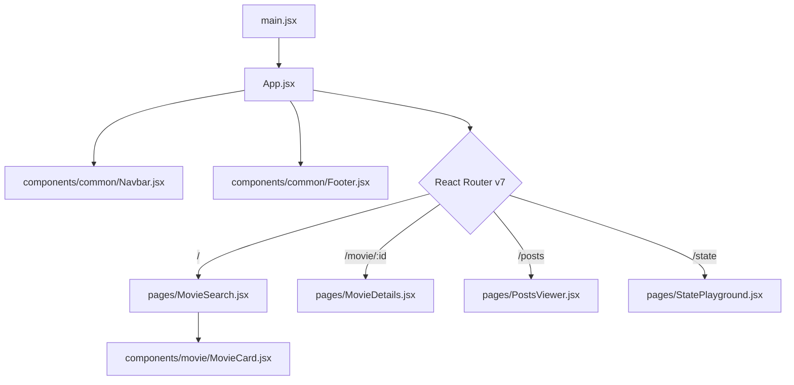

# 🚀 React Suite Developer Hub

A premium, fully responsive developer workspace consolidating three interactive applications—a **Show Finder**, an **API Posts Board**, and a **State Laboratory**—into a single unified layout.

Designed with a dark-mode glassmorphic aesthetic, dynamic animations, and optimal state management strategies. Built on **React 19**, **React Router v7**, and **Tailwind CSS v4**.

---

## 🔗 Table of Contents
1. [🌟 Visual & Feature Tour](#-visual--feature-tour)
2. [📂 Project Architecture](#-project-architecture)
3. [💻 Tech Stack & Custom Utilities](#-tech-stack--custom-utilities)
4. [⚡ Getting Started & Installation](#-getting-started--installation)
5. [🛡️ Linting & Performance Optimization](#-linting--performance-optimization)
6. [📄 License](#-license)

---

## 🌟 Visual & Feature Tour

### 🎬 Show Finder
* **TVMaze Integration**: Dynamically query shows, cast details, schedule, and networks.
* **Prepopulated Grid**: Automatically searches and lists Batman-related shows on mount so the user has visual content instantly.
* **Badges**: Show ratings, premiered years, genres, and language.
* **Show Details Page**: Seamless back navigations and deep linking using `react-router-dom` params.

### 📄 Posts Board
* **JSONPlaceholder API**: Real-time posts fetched from the REST API.
* **Dynamic Search Filter**: Filters titles and descriptions instantly on the client side without triggering API roundtrips.
* **Simulation Panel**: Add new post content locally. Simulated client posts are prepended instantly to the feed and styled with a distinct cyan glow to denote client-side simulation.
* **Author Avatars**: Auto-generated custom gradient backgrounds computed from the user's ID.
* **Interactive Modal View**: Click "Read Full Article" to view details in a clean backdrop-blur modal overlay.

### 🧪 State Laboratory
* **Counter Reactor**: Tracks value states and logs structural change events in an active console effect stream.
* **Virtual Pet (Object Mutation)**: Simulates Max/Fluffy the pet. The pet's emoji status changes dynamically from Starved (💀) to Overstuffed (🤢) based on feed actions, showcasing safe state copying using the spread operator.
* **Array Cart**: Mutate lists immutably. Append pre-selected snacks, add custom text items, or click directly on list items to remove them from state.

---

## 📂 Project Architecture

The project has been organized from a flat layout to a clean, modular structure. Below is the file mapping:

```text
src/
├── assets/                     # Static assets (images, icons, etc.)
│   ├── hero.png
│   ├── react.svg
│   └── vite.svg
├── components/                 # Decoupled reusable React components
│   ├── common/                 # Global layout wrappers
│   │   ├── Footer.jsx          # Interactive global footer layout
│   │   └── Navbar.jsx          # Mobile drawer glassmorphism header
│   └── movie/                  # Domain-specific items
│       └── MovieCard.jsx       # Individual search grid card
├── pages/                      # Page components hooked to routing
│   ├── MovieDetails.jsx        # Show Details page
│   ├── MovieSearch.jsx         # Search Landing Page
│   ├── PostsViewer.jsx         # Live posts board & modal
│   └── StatePlayground.jsx     # State lab playground dashboard
├── styles/                     # Global styles
│   ├── App.css                 # Main layouts, styling system and custom animations
│   └── index.css               # Base typography and color variables
├── App.jsx                     # Route paths & Global Provider Setup
└── main.jsx                    # Client bootstrapping
```

### Flow Diagram



---

## 💻 Tech Stack & Custom Utilities

* **Vite**: Rapid Hot Module Replacement (HMR) and production bundling.
* **React 19**: Modern layout scheduling.
* **React Router v7**: Declarative path matches (`BrowserRouter`, `Routes`, `Route`, `Link`, `useLocation`).
* **Tailwind CSS v4**: Utility-first CSS using `@import` structures.
* **CSS Custom Animations**:
  * `animate-fade-in`: Transitions page views smoothly during mount.
  * `animate-scale-up`: Slides and expands details popups for enhanced user experience.

---

## ⚡ Getting Started & Installation

### Prerequisites
Make sure you have [Node.js](https://nodejs.org/) installed (v18.0.0 or higher is recommended).

### Commands

1. **Clone the Repository**
   ```bash
   git clone https://github.com/yourusername/react-suite-developer-hub.git
   cd react-suite-developer-hub
   ```

2. **Install Dependencies**
   ```bash
   npm install
   ```

3. **Start the Development Server**
   ```bash
   npm run dev
   ```
   Open [http://localhost:5173](http://localhost:5173) in your browser to view the application.

4. **Compile Production Build**
   ```bash
   npm run build
   ```

---

## 🛡️ Linting & Performance Optimization

This repository is optimized for speed and strict compliance:
* **No Unnecessary State Hook Syncing**: Filter lists are computed during the render phase rather than synced via multiple `useEffect` triggers, reducing re-render cycles.
* **Zero ESLint Warnings**: Complies with React standard lint configurations and avoids stale dependencies inside hooks.
* **Component Splitting**: Ensures page containers are separated from atomic UI elements (like cards) for clean unit testing.

---

## 📄 License

Distributed under the MIT License. See `LICENSE` for more information.
